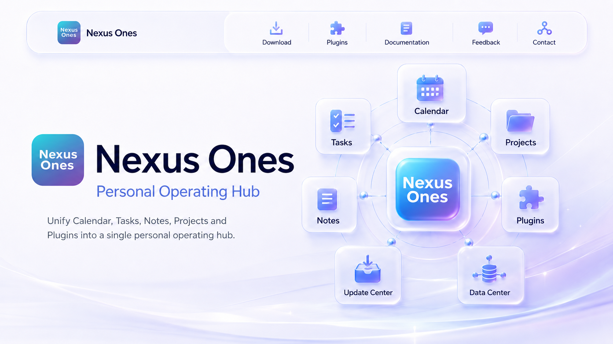
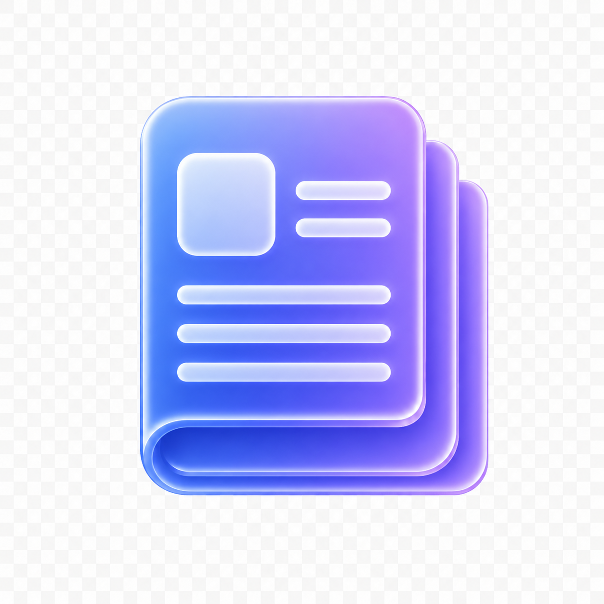

  

<h1 align="center">Nexus Ones</h1>

  Personal Operating Hub

  Unify Calendar, Tasks, Notes, Projects and Plugins into a single personal operating hub.

<table>
  <tr>
    <td align="center">
      <a href="https://github.com/NexusMemory/nexus-ones-release/releases">
         
        Download
      </a>
    </td>
    <td align="center">
      <a href="plugins/README.md">
         
        Plugin Center
      </a>
    </td>
    <td align="center">
      <a href="docs/plugin-development-guide.md">
         
        Developer Guide
      </a>
    </td>
    <td align="center">
      <a href="https://github.com/NexusMemory/nexus-ones-release/issues">
         
        Feedback
      </a>
    </td>
    <td align="center">
      <a href="mailto:LeungKinWah@outlook.com">
         
        Contact
      </a>
    </td>
  </tr>
</table>
