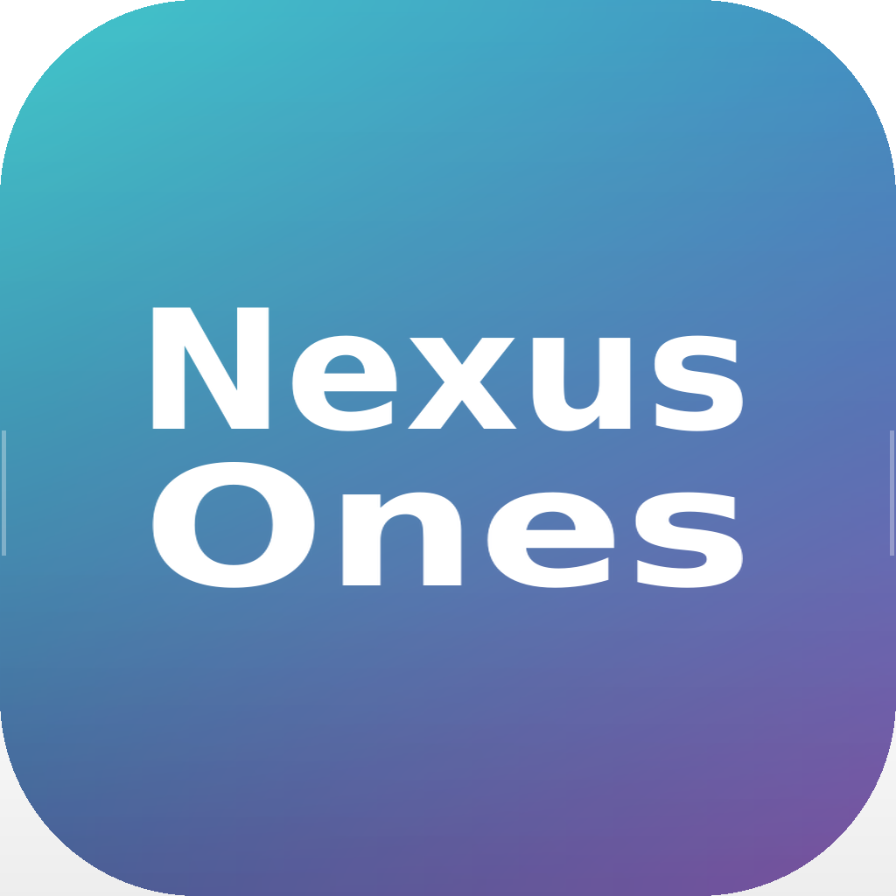

<p align="center">
  
</p>

<br>

<p align="center">
  
</p>

<h1 align="center">Nexus Ones</h1>

<p align="center">
  <strong>个人办公中枢系统</strong>
</p>

<p align="center">
  将日历、待办、提醒、备忘、项目、课程与插件统一到一个个人工作台。
</p>

<p align="center">
  
  
  
  
</p>

<br>

---

## 快速入口

<br>

<div align="center">

|  |  |  |
|:-:|:-:|:-:|
| <a href="https://github.com/NexusMemory/nexus-ones-release/releases/latest"></a> | <a href="https://github.com/NexusMemory/nexus-ones-release/tree/main/plugins"></a> | <a href="https://github.com/NexusMemory/nexus-ones-release/tree/main/docs"></a> |
| **下载中心** | **插件中心** | **文档中心** |
| 获取最新版 macOS / Windows 安装包 | 浏览与管理 Nexus Ones 插件 | 使用手册与开发文档 |

</div>

<br>

<div align="center">

|  |  |
|:-:|:-:|
| <a href="https://github.com/NexusMemory/nexus-ones-release/issues"></a> | <a href="mailto:LeungKinWah@outlook.com"></a> |
| **反馈中心** | **联系我们** |
| 提交问题与功能建议 | 联系 Nexus Lab |

</div>

<br>

---

## 产品简介

Nexus Ones 是一套面向个人用户的工作与生活秩序系统。

它不是单一的日历、待办或备忘录工具，而是一个 Personal Operating Hub，用于把分散的信息、任务、项目、课程与插件能力统一到一个稳定、轻量、可扩展的个人工作台中。

---

## 核心能力

### Today Dashboard

统一查看今日状态、待办、提醒、日历事项、项目进度、倒计时与四象限任务。

### Calendar

支持年视图、月视图、周视图、日视图、中国节假日、农历显示与日程管理。

### Tasks & Reminders

统一管理待办、提醒、备忘、项目事项与日程事项。

| 等级 | 含义 |
|---|---|
| P1 | 非常重要 |
| P2 | 重要 |
| P3 | 普通 |
| P4 | 不重要 |

### Four Quadrants

根据 P 等级与时间紧迫性自动判断任务象限：

- 重要且紧急
- 重要不紧急
- 不重要但紧急
- 不重要不紧急

### Plugin Runtime

v0.2.4 开始实装插件运行时，支持 HTML 插件、JavaScript 插件、本地插件存储、Runtime Sandbox 与插件消息机制。

示例插件：

```text
hello.nexus
```

### Snapshot & Restore

内置快照系统，支持创建快照、恢复快照、回滚与数据保护。

---

## 数据安全

Nexus Ones 的用户数据独立于应用本体。

推荐数据目录：

```text
Nexus Ones Data
├── production
├── sandbox
├── plugins
├── backups
└── config
```

支持：

- 覆盖安装不丢数据
- 卸载重装重新识别
- 插件数据独立存储
- iCloud 跨设备同步

---

## 跨设备工作流

推荐将数据目录设置为：

```text
iCloud Drive
└── Nexus Ones Data
```

典型工作流：

```text
Mac mini
     ↓
  iCloud
     ↓
MacBook Air
```

---

## 当前版本

### Nexus Ones v0.2.4 Beta

World Cup 2026 Edition

本轮测试重点：

- Plugin Runtime
- Update Center
- Snapshot & Restore
- Status Light
- 数据目录管理
- 跨设备同步
- Windows 安装体验

---

## 下载

最新版下载：

[Nexus Ones 最新版本](https://github.com/NexusMemory/nexus-ones-release/releases/latest)

如果 latest 页面暂不可用，请进入：

[Nexus Ones Releases](https://github.com/NexusMemory/nexus-ones-release/releases)

---

## 路线图

### v0.3

- Plugin Marketplace
- Desktop Widgets
- Health Center
- Plugin SDK

### v0.4

- AI Workspace
- Knowledge Hub
- Cross Device Sync Enhancement

### v1.0

- Stable Release
- Complete Plugin Ecosystem
- Nexus Ones Public Launch

---

## 技术架构

Frontend：

```text
React
TypeScript
Vite
```

Backend：

```text
Tauri 2
Rust
SQLite
```

Platforms：

```text
macOS
Windows
```

---

## Nexus Lab

Designed and developed by Nexus Lab.

Building software for productivity, education and personal operating systems.

---

## License

Copyright © Nexus Lab

All Rights Reserved.
